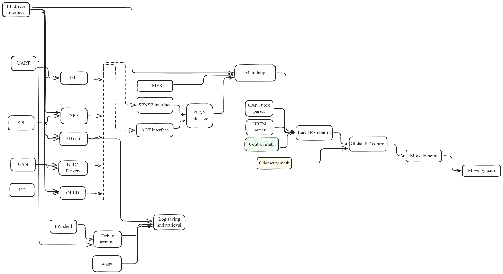

# Прошивка для FootBot 4
Программатор JLink. Чтобы поменять на ST-Link, надо изменить параметр в platformio.ini

## Важные моменты
Так как main - это cpp файл, то для корректной работы прерываний требуется extern "C". https://community.platformio.org/t/hal-delay-infinite-loop-due-to-return-0-from-hal-gettick/45129
## Стек: 
1. Platformio
2. HAL
3. letter-shell + extensions

## Стуктура исходного кода

https://web.archive.org/web/20231210061404/https://api.csswg.org/bikeshed/?force=1&url=https://raw.githubusercontent.com/vector-of-bool/pitchfork/develop/data/spec.bs

## Дерево технологий



## Заметки

### Компиляция letter-shell

Для компиляции letter-shell потребовались некоторые танцы с бубном. Во первых, для экспорта функций необходимо модифицировать файл линковки `.ld`.

Иначе комипилятор ругается на:

```
.pio/build/disco_f429zi/lib117/libletter-shell.a(shell.o): In function `shellInit':
shell.c:(.text.shellInit+0x7c): undefined reference to `_shell_command_start'
shell.c:(.text.shellInit+0x80): undefined reference to `_shell_command_end'
collect2: error: ld returned 1 exit status
```

Конкретно, интересующий файл лежал по пути `~/.platformio/packages/tool-ldscripts-ststm32/stm32f4/STM32F429ZITX_FLASH.ld`. Его надо скопировать в наш проект:

```bash
cp ~/.platformio/packages/tool-ldscripts-ststm32/stm32f4/STM32F429ZITX_FLASH.ld .
```

И в нем надо добавить строки:

```diff
  /* Constant data goes into FLASH */
  .rodata :
  {
    . = ALIGN(4);
    *(.rodata)         /* .rodata sections (constants, strings, etc.) */
    *(.rodata*)        /* .rodata* sections (constants, strings, etc.) */
    . = ALIGN(4);
+   _shell_command_start = .;
+   KEEP (*(shellCommand))
+   _shell_command_end = .;
    . = ALIGN(4);
  } >FLASH
```

После чего в `platformio.ini` надо указать этот кастомный файл:

```diff
...

+board_build.ldscript = STM32F429ZITX_FLASH.ld
```

### Компиляция log

При компиляции библиотек platformio, судя по всему, смотрит только на файлы из папки `src`. Файлы логгера находились в папке `extensions/log`, поэтому функции логгера не компилировались. Чтобы они смогли автоматически компилироваться нужные расширения были перенесены в директорию `src/extensions/`. Так они автоматически подхватываются и компилируются.

### Include path

Чтобы была возможность однокнопочного подключения заголовочных файлов, необходимо их пути добавить в флаги компиляции. Кроме как в `platformio.ini`, это можно сделать и в файле `library.json` в поле `build`, например вот так:

```json
{
    "name": "letter-shell",
    "version": "3.2.4",
    "keywords": "shell, embedded, command line, cli, console",
    "description": "Letter shell for embedded systems",
    "repository": {
        "type": "git",
        "url": "https://github.com/NevermindZZT/letter-shell.git"
    },
    "frameworks": "stm32cube",
    "platforms": "ststm32",
    "build": {
        "libArchive": false,
        "flags": [
            "-Isrc/",
            "-Isrc/extensions/cpp_support",
            "-Isrc/extensions/log"
        ]
    }
}
```
